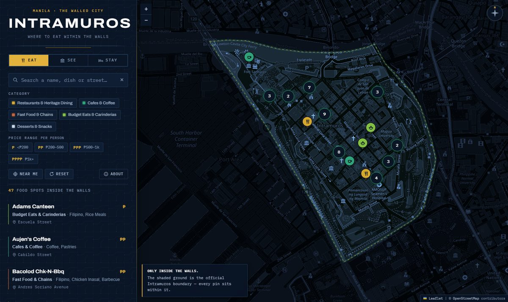
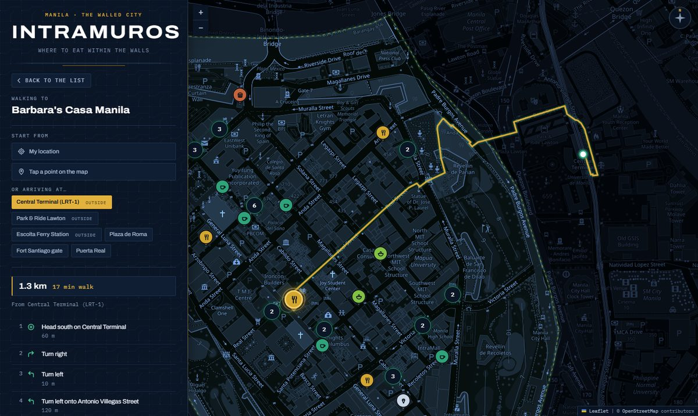

# Intramuros Guide

An interactive map of the walled city of Manila, built for visiting researchers at
**MIRC 2026** — where to eat, what to see, where to stay, and step-by-step walking
directions to any of it.

### 🗺️ [markdaniel0702.github.io/MIRC-2026-Interactive-Intramuros-Food-Map-Guide](https://markdaniel0702.github.io/MIRC-2026-Interactive-Intramuros-Food-Map-Guide/)

> **Not live yet?** GitHub Pages has to be switched on once, in
> *Settings → Pages*. It takes about a minute — see [`DEPLOY.md`](DEPLOY.md).



---

## What's on it

| Tab | Contents |
|---|---|
| **Eat** | **47** restaurants, cafés, carinderias and fast-food branches, with price ranges |
| **See** | **21** heritage sights, with entrance fees, opening hours and realistic visit times |
| **Stay** | **3** hotels — every property inside the walls that a traveller can actually book |

Plus **walking directions** to any of them, from your location, a tapped point, or one of
six arrival presets.

- **Search** by name, dish, cuisine, street or period — press <kbd>/</kbd> to jump to it
- **Filter** by category and by price / entrance fee, in any combination
- **The list and the map stay in sync** — hover a card to lift its pin, click a card to
  fly to it, click a pin to scroll its card into view
- **Near me** sorts everything by walking distance
- Responsive: a sidebar on desktop, a drag-up sheet on a phone
- Keyboard accessible, screen-reader labelled, honours `prefers-reduced-motion`

---

## Everything on the map is inside Intramuros — and that's enforced

This is the part worth knowing. The guide's one hard rule is that nothing from Binondo,
Ermita, Malate or Quiapo appears. That is not a promise in a README — it's a test.

Every place was collected by querying **inside the official boundary polygon**
(OpenStreetMap relation [`103707`](https://www.openstreetmap.org/relation/103707)), so
each one is in Intramuros by construction. A script then re-checks every coordinate
against that same polygon:

```bash
node tools/verify-in-intramuros.mjs
```

```
  1. Location — is every spot inside Intramuros?      47/47 PASS
  2. Schema — is every record well formed?            PASS
  3. Tourist spots — is every sight inside?           21/21 PASS
  4. Accommodation — is every property inside?         8/8  PASS

  VERIFIED — every spot is inside Intramuros and every record is valid.
```

It exits non-zero on any failure, so it works as a pre-commit or CI gate. Run it after
touching any data file.

The same polygon is drawn on the map as the lit ground, with everything outside it dimmed —
so the constraint is something you can *see*, not just something you're told.

> The one deliberate exception: three transit points (LRT Central Terminal, Park & Ride
> Lawton, Escolta Ferry) sit outside the walls and are offered **only** as starting points
> for directions. They're labelled "outside" and never appear as destinations.

---

## Directions



Click any marker or list entry, then **Get directions**. Start from your current location,
by tapping anywhere on the map, or from a preset arrival point.

Routing comes from the **FOSSGIS OSRM pedestrian service** — the same one
openstreetmap.org uses for its own directions. No API key, nothing secret in the client.

OSRM returns maneuver *objects* rather than sentences, and the usual companion library
isn't published on any CDN, so [`routing.js`](routing.js) renders the instructions itself.
That keeps the dependency list unchanged.

**If routing is unavailable**, the feature degrades instead of breaking: you still get a
straight-line distance, a walking estimate, and a link out to OpenStreetMap directions.
Same for a denied location permission — the presets remain available and the interface
explains what happened.

---

## Run it locally

No build step, no `npm install`, no API keys.

```bash
python -m http.server 8000
# then open http://localhost:8000
```

Opening `index.html` straight from disk mostly works too, but serving it over HTTP is
better — and note that **"Near me" needs HTTPS or localhost**, so it only really works on
the deployed site or via `localhost`.

---

## Deploy

Push to `main`; GitHub Pages serves the repo root as-is. Full instructions, the
post-deploy checklist and troubleshooting are in **[`DEPLOY.md`](DEPLOY.md)**.

---

## Project structure

```
index.html                      page shell, tabs, directions panel, about dialog
styles.css                      design system, responsive layout, map + popup styling
app.js                          modes, markers, search, filters, list↔map sync, directions
routing.js                      OSRM client + walking-instruction renderer

data/food-spots.js              47 food spots  · PRICE_TIERS, CATEGORIES
data/tourist-spots.js           21 sights      · FEE_TIERS, VENUE_ANCHOR, passport info
data/hotels.js                  8 properties   · 3 flagged `mapped` for the Stay tab
data/start-points.js            6 arrival points for directions
data/intramuros-boundary.js     the official boundary polygon (61 points)

tools/verify-in-intramuros.mjs  the accuracy gate

DATA.md                         sources, method, price methodology, known limitations
HOTELS.md                       accommodation research in full
DEPLOY.md                       GitHub Pages instructions
```

Adding a place means editing one array and re-running the verify script. The map and the
list both read from the same data, so there is nothing to keep in step.

### Two edits worth knowing about

**Set the venue anchor.** `VENUE_ANCHOR` in [`data/tourist-spots.js`](data/tourist-spots.js)
defaults to Plaza de Roma and drives every "N min walk" on the site. Point it at the
conference venue and all of them re-base themselves:

```js
const VENUE_ANCHOR = { name: 'Your venue', lat: 14.5921, lng: 120.9730 };
```

**Swap the tile provider** by editing the single `L.tileLayer(...)` call in `app.js`. The
navy tinting in `styles.css` is applied on top of whatever tiles arrive, so the look
survives the change.

---

## About the data

Names and coordinates come from **OpenStreetMap** via the Overpass API, retrieved
2026-09-03 and cross-checked against Nominatim.

- **Entrance fees** are from the Intramuros Administration and site operators — published
  and reasonably stable. There's also a ₱350 **Intramuros Passport** covering five sites,
  which the See tab surfaces once it's worth buying.
- **Restaurant prices are indicative estimates, not quotes.** Only a handful of the 47
  publish menu pricing, so each gets a tier plus an explicit peso band and a review date.
  Presenting a guess as an exact figure would be worse than an honest range.
- **Hotel rates are a dated snapshot, not live pricing.** Nightly rates move daily.

The reasoning behind all of that, including what *couldn't* be verified, is in
[`DATA.md`](DATA.md) and [`HOTELS.md`](HOTELS.md).

---

## Built with

Leaflet 1.9.4 · Leaflet.markercluster 1.5.3 · Archivo + IBM Plex Mono — all from CDN.
No framework, no bundler, no backend.

## Attribution

Map data, place information and the boundary polygon © [OpenStreetMap](https://www.openstreetmap.org/copyright)
contributors, licensed under the [ODbL](https://opendatacommons.org/licenses/odbl/).
Walking routes by the [FOSSGIS OSRM service](https://routing.openstreetmap.de/).
Categories, price tiers, visit durations and descriptions were written for this project.
