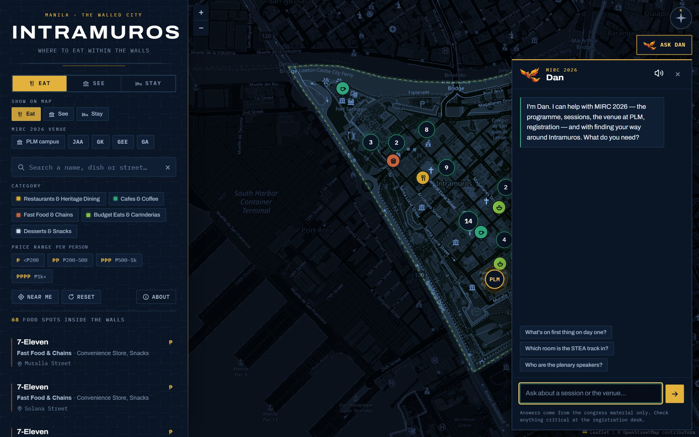
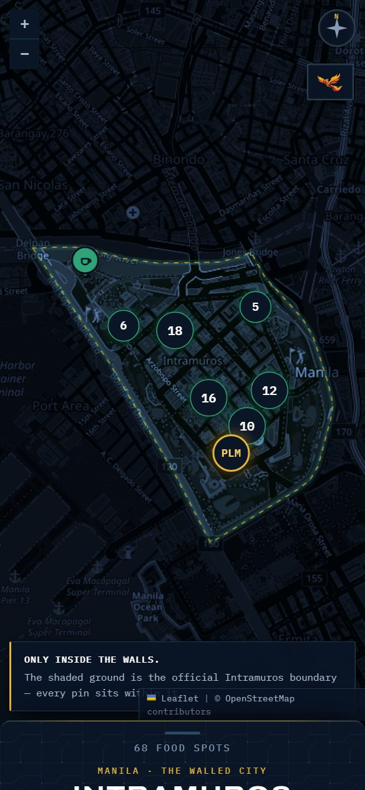

# Intramuros Guide

An interactive map of the walled city of Manila, built for visiting researchers at
**MIRC 2026** — where to eat, what to see, where to stay, step-by-step walking
directions to any of it, and an AI assistant who knows the congress programme.

### 🗺️ [markdaniel0702.github.io/MIRC-2026-Interactive-Intramuros-Food-Map-Guide](https://markdaniel0702.github.io/MIRC-2026-Interactive-Intramuros-Food-Map-Guide/)


---

## What's on it

| Tab | Contents |
|---|---|
| **Eat** | **68** restaurants, cafés, carinderias, fast-food branches and hotel dining rooms, with price ranges (59 OSM-verified + 9 user-pinned — see `DATA.md`) |
| **See** | **21** heritage sights, with entrance fees, opening hours and realistic visit times |
| **Stay** | **2** hotels — the properties inside the walls with both a public booking path and a real price. (A third, Residencia 729, is bookable but has no published rate — see `HOTELS.md`.) |

Plus a highlighted **PLM** (Pamantasan ng Lungsod ng Maynila) campus landmark — the
MIRC 2026 venue — that zooms the map in when tapped and reveals its buildings and halls
(JAA, GK, GEE, GA) once you're zoomed close, with a **venue strip** in the panel that
jumps to any of them from every tab; and **walking directions** to any listing *or to
any of those campus buildings* — from your location, a tapped point, the venue itself,
or one of six arrival presets.

- **Search** by name, dish, cuisine, street or period — press <kbd>/</kbd> to jump to it
- **Filter** by category and by price / entrance fee, in any combination
- **The list and the map stay in sync** — hover a card to lift its pin, click a card to
  fly to it, click a pin to scroll its card into view
- **Near me** sorts everything by walking distance
- **Ask Dan**, an AI assistant, for anything about the congress or getting around
- Responsive: a sidebar on desktop, a drag-up sheet on a phone
- Keyboard accessible, screen-reader labelled, honours `prefers-reduced-motion`

---

## Meet Dan



**Ask Dan** (top-right, or the phoenix mark) opens a chat panel that answers questions
about the MIRC 2026 programme — sessions, speakers, rooms, registration — and about
getting around Intramuros, then **declines everything else**. It's grounded only in the
congress's own material, not general knowledge, so it won't improvise an answer it
doesn't have.

Under the hood: the corpus (`public/data/chat-corpus.json`) is retrieved down to a
question-shaped slice before it ever reaches a model, which is what makes a free-tier
LLM (Groq, with Gemini as a fallback) viable at congress scale. The client is static and
holds no API key — a small Cloudflare Worker (`worker/`) is the only server-side piece.
Full pipeline, retrieval design and setup instructions are in **[`CHATBOT.md`](CHATBOT.md)**.

Dan can also put a place on the map for you — ask "where is GEE?" and its **Get
directions** button is one tap away.

---

## Everything on the map is inside Intramuros — and that's enforced

This is the part worth knowing. The guide's one hard rule is that nothing from Binondo,
Ermita, Malate or Quiapo appears. That is not a promise in a README — it's a test.

Every place was collected by querying **inside the official boundary polygon**
(OpenStreetMap relation [`103707`](https://www.openstreetmap.org/relation/103707)), so
each one is in Intramuros by construction. A script then re-checks every coordinate
against that same polygon:

```bash
node tools/verify-in-intramuros.mjs
```

```
  1. Location — is every spot inside Intramuros?      68/68 PASS
  2. Schema — is every record well formed?            PASS  (9 user-pinned)
  3. Tourist spots — is every sight inside?           21/21 PASS
  4. Accommodation — is every property inside?         8/8  PASS
  5. Landmarks — is every landmark inside?              5/5 PASS

  VERIFIED — every spot is inside Intramuros and every record is valid.
```

Nine eateries have no OpenStreetMap node. All are **user-pinned** — an exact coordinate
supplied directly by a visitor (a Google Maps pin), shown as a normal pin. A second class,
**address-estimated** (pin from the street address, flagged approximate, dashed marker),
is supported but currently empty. Every one is boundary-checked by the same gate — one
visitor-supplied pin landed ~2 km out and was rejected.

It exits non-zero on any failure, so it works as a pre-commit or CI gate. Run it after
touching any data file.

The same polygon is drawn on the map as the lit ground, with everything outside it dimmed —
so the constraint is something you can *see*, not just something you're told.

> The one deliberate exception: three transit points (LRT Central Terminal, Park & Ride
> Lawton, Escolta Ferry) sit outside the walls and are offered **only** as starting points
> for directions. They're labelled "outside" and never appear as destinations.

---

## Directions


Click any marker or list entry, then **Get directions**. Start from your current location,
by tapping anywhere on the map, from **the venue** (for the walk from PLM to lunch), or from
a preset arrival point. The PLM campus marker and each of its buildings (JAA, GK, GEE, GA)
offer the same button, so a visitor can be walked to the specific building their session
is in, not just to the campus gate — and asking Dan *"where is GEE?"* puts that building
on the map with the button one tap away.

Once a route is drawn, **Track my location live** turns on `watchPosition` and follows you
along it — distance remaining, an ETA, and whether you're getting closer or moving away,
updating as you walk. It degrades honestly: a low-accuracy GPS fix says so, and a denied
permission stops tracking with a plain explanation instead of failing silently.

Routing comes from the **FOSSGIS OSRM pedestrian service** — the same one
openstreetmap.org uses for its own directions. No API key, nothing secret in the client.

OSRM returns maneuver *objects* rather than sentences, and the usual companion library
isn't published on any CDN, so [`src/lib/routing.ts`](src/lib/routing.ts) renders the
instructions itself. That keeps the dependency list unchanged.

**If routing is unavailable**, the feature degrades instead of breaking: you still get a
straight-line distance, a walking estimate, and a link out to OpenStreetMap directions.
Same for a denied location permission — the presets remain available and the interface
explains what happened.

---

## On a phone

The panel becomes a **drag-up sheet** anchored to the map instead of a fixed sidebar —
collapsed to a handle and a count by default, so the map (and the boundary, and the venue)
is the first thing you see. Every feature above — search, filters, Dan, directions, live
tracking — works the same way, just reflowed for a narrow, tall viewport, and verified
down to a 360px-wide screen.



---

## Run it locally

React + TypeScript, built with Vite. No API keys needed for the map itself.

```bash
npm install
npm run dev
# then open the printed http://localhost:5173/... URL
```

The dev server proxies `/chat` to the deployed Worker (see `vite.config.ts`), so the
assistant panel works locally too — the Worker's CORS allowlist only needs the
production origin, not every developer's local port.

`npm run build` produces `dist/`; `npm run preview` serves that build locally so you can
check it before pushing. `npm run typecheck` runs a standalone type check.

---

## Deploy

Push to `main`. A GitHub Actions workflow (`.github/workflows/deploy.yml`) builds the
site and publishes `dist/` to GitHub Pages — no manual build step. Full instructions,
the post-deploy checklist and troubleshooting are in **[`DEPLOY.md`](DEPLOY.md)**.

Dan's Worker is deployed separately (`worker/`, on Cloudflare) and needs its own API key
set once via `wrangler secret put` — see **[`CHATBOT.md`](CHATBOT.md)**. Until that's
done the chat panel still opens; it just says plainly that it can't answer yet, rather
than failing silently. Nothing about the map, directions or the rest of the site depends
on it.

---

## Project structure

```
index.html                      Vite entry point -- icons, manifest, Open Graph metadata
src/main.tsx                    mounts React, imports Leaflet + styles.css
src/App.tsx                     top-level layout: Panel + MapView + ChatPanel + AboutDialog
src/styles.css                  design system, responsive layout, map + popup styling
src/state/store.ts              app state (useReducer) -- mode, filters, selection, directions
src/hooks/useLeafletMap.ts      the imperative map core -- markers, popups, flyTo, live tracking
src/hooks/useVisibleSpots.ts    filtered + sorted spot list, derived from state
src/components/                Panel, SpotList, DirectionsPanel, VenueBar, ChatPanel, AboutDialog, etc.
src/lib/                        routing.ts (OSRM client), format/icons/filter/popupHtml helpers
src/data/modes.ts               the Eat/See/Stay MODES config + one-time search index
src/data/destinations.ts        resolves a "Get directions" target: any spot, or a landmark

data/food-spots.js              68 food spots  · 59 OSM-verified + 9 user-pinned
data/tourist-spots.js           21 sights      · FEE_TIERS, VENUE_ANCHOR, passport info
data/hotels.js                  8 properties   · 3 flagged `mapped` for the Stay tab
data/start-points.js            6 arrival points for directions
data/landmarks.js               PLM landmark + campus sub-points (shown when zoomed in)
data/mirc-2026.json             the congress knowledge base Dan answers from
data/intramuros-boundary.js     the official boundary polygon (61 points)
data/types.d.ts                 shared TypeScript interfaces for the data above

public/data/chat-corpus.json    built corpus Dan's Worker (and the client) fetch
public/favicon.svg              app icon · public/apple-touch-icon.png, icon-*.png, og-image.jpg
public/robots.txt, sitemap.xml  crawl and discovery for the deployed site
public/404.html                 branded not-found page for a mistyped URL on GitHub Pages

worker/                         the Cloudflare Worker that answers Dan's questions
tools/verify-in-intramuros.mjs  the accuracy gate
tools/build-corpus.mjs          builds public/data/chat-corpus.json for the chat assistant
tools/import-abstracts.py       attaches abstracts/authors from the presenter + submissions docs

.github/workflows/deploy.yml    builds and publishes dist/ to GitHub Pages

DATA.md                         sources, method, price methodology, known limitations
HOTELS.md                       accommodation research in full
CHATBOT.md                      Dan's architecture, retrieval design and setup instructions
DEPLOY.md                       GitHub Pages instructions
```

Adding a place means editing one array in `data/` and re-running the verify script. The
map and the list both read from the same data, so there is nothing to keep in step.

### Two edits worth knowing about

**Set the venue anchor.** `VENUE_ANCHOR` in [`data/tourist-spots.js`](data/tourist-spots.js)
drives every "N min walk" on the site. It is set to Pamantasan ng Lungsod ng Maynila
(PLM), the campus flagged as the MIRC 2026 venue, using PLM's OSM centre point. If
sessions run in a specific building or hall, point it there and every distance re-bases
itself:

```js
export const VENUE_ANCHOR = { name: 'Your venue', lat: 14.5869, lng: 120.9764 };
```

**Swap the tile provider** by editing the single `L.tileLayer(...)` call in
`src/hooks/useLeafletMap.ts`. The navy tinting in `src/styles.css` is applied on top of
whatever tiles arrive, so the look survives the change.

---

## About the data

Names and coordinates come from **OpenStreetMap** via the Overpass API, retrieved
2026-09-04 and cross-checked against Nominatim (with later additions and corrections —
see `DATA.md`).

- **Entrance fees** are from the Intramuros Administration and site operators — published
  and reasonably stable. There's also a ₱350 **Intramuros Passport** covering five sites,
  which the See tab surfaces once it's worth buying.
- **Restaurant prices are indicative estimates, not quotes.** Only a handful of the 68
  publish menu pricing, so each gets a tier plus an explicit peso band and a review date.
  Presenting a guess as an exact figure would be worse than an honest range.
- **Nine eateries have no OpenStreetMap node** — all user-pinned (an exact coordinate
  supplied by a visitor), boundary-checked like everything else.
- **Hotel rates are a dated snapshot, not live pricing.** Nightly rates move daily.
- **Dan answers only from the congress's own material** (`data/mirc-2026.json`); a few
  fields — registration logistics, one keynote bio — are still open source-side, listed
  in `CHATBOT.md`, not silently guessed at.

The reasoning behind all of that, including what *couldn't* be verified, is in
[`DATA.md`](DATA.md) and [`HOTELS.md`](HOTELS.md).

---

## Privacy

There's no account, no sign-up and no form to fill in, so there's nothing to collect in
the usual sense. In short: your location, if you share it, stays in the browser and is
only ever sent (as coordinates, for a route) to the OSRM routing service; a question you
ask Dan is relayed through the Worker to Groq or Gemini to generate an answer and isn't
tied to your name or any account, because the site has none. **No cookies, no analytics,
no ad tracking.** The full statement — same wording, always in reach — is in the app's
own **About** dialog (`src/components/AboutDialog.tsx`).

---

## Site polish

A few things exist purely so the deployed site behaves like a normal public site rather
than a bare build:

- **Favicon set** — `favicon.svg` plus `apple-touch-icon.png` and `icon-192`/`icon-512.png`
  for home-screen installs, wired through `site.webmanifest`.
- **Open Graph / Twitter Card** metadata and a rendered `og-image.jpg`, so a shared link
  previews with the map's own look rather than a blank card.
- **`robots.txt` and `sitemap.xml`** — the site is public and meant to be found.
- **A branded `404.html`** for a mistyped URL on GitHub Pages, instead of the platform default.
- The browser tab **title updates with the active tab** (Eat / See / Stay).

None of this touches the map, the data or Dan — it's the metadata a search engine, a
messaging app's link preview, or a home-screen install reads before the app ever loads.

---

## Known limitations

- **Restaurant prices and hotel rates are estimates, not live quotes** — see *About the
  data* above. Confirm anything time-sensitive with the venue.
- **Dan only knows what's in `data/mirc-2026.json`.** A handful of programme details
  (registration logistics, one keynote's bio) are genuine gaps in the source material,
  tracked in `CHATBOT.md`, not answered by guessing.
- **Dan's free-tier providers (Groq, Gemini) have daily request ceilings.** The retrieval
  step and a server-side cache keep normal use well inside them, but a very busy day could
  still hit a rate limit — the panel says so rather than hanging.
- **Live tracking and "Near me" need a real GPS fix and a secure context** (`https://`,
  which GitHub Pages provides) — they won't work over plain `http://` or from `file://`.
- **OSRM can only end a route on a public street.** PLM is a gated campus with more than
  one entrance, so the last step reads "nearest public street," not "you have arrived" —
  see the note in the Directions panel itself.

---

## Built with

React 18 + TypeScript, built with Vite. Leaflet 1.9.4 · Leaflet.markercluster 1.5.3 ·
react-icons · Archivo + IBM Plex Mono (Google Fonts). Dan is served by a small
Cloudflare Worker (`worker/`) in front of Groq / Gemini, grounded on a retrieved slice of
`public/data/chat-corpus.json` — see `CHATBOT.md`. Everything else is static.

## Attribution

Map data, place information and the boundary polygon © [OpenStreetMap](https://www.openstreetmap.org/copyright)
contributors, licensed under the [ODbL](https://opendatacommons.org/licenses/odbl/).
Walking routes by the [FOSSGIS OSRM service](https://routing.openstreetmap.de/).
Categories, price tiers, visit durations and descriptions were written for this project.

## Credits

Created by **Mark Daniel Apelledo** — creator of the Intramuros Map and Dan, its AI guide.

Built under the guidance of advisers **Dr. Dan Michael A. Cortez**, **Ms. Editha S. Medina**
and **Mr. Neil Marcus T. Manubay**.

Dan's voice was added by **Christian Andrei V. Santiago**, credited specifically for
building the text-to-speech capability. **Alvin V. Genota** is a consultant to the
creators — he was Mr. Santiago's professor last year and is currently Mr. Apelledo's
Intelligent Systems professor.
