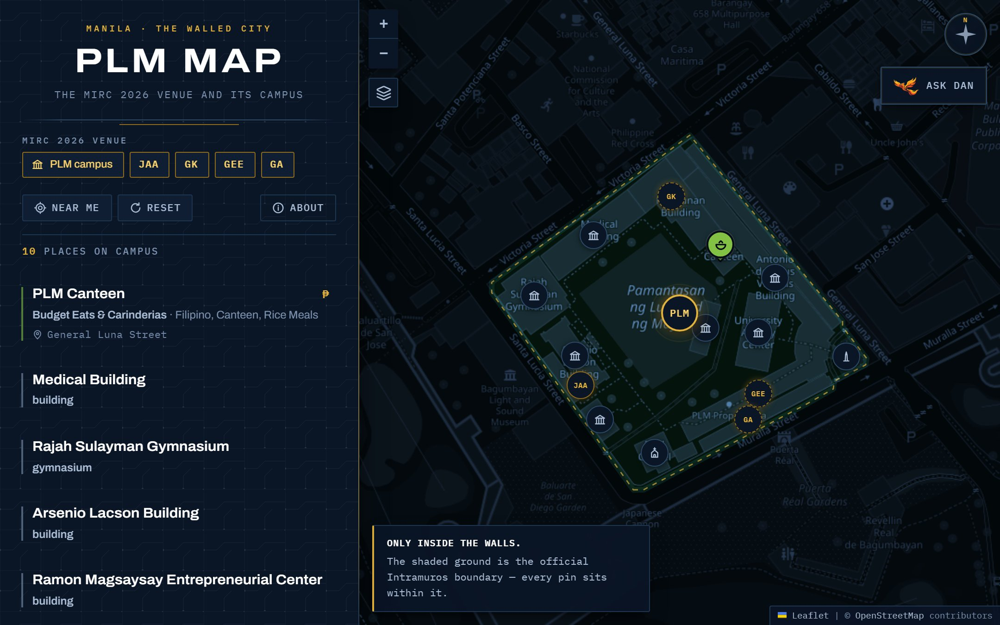
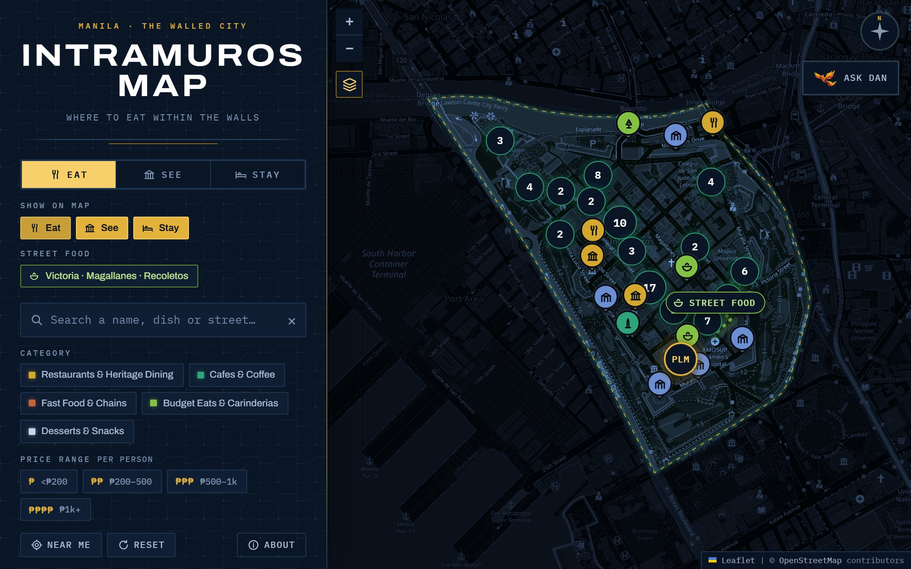
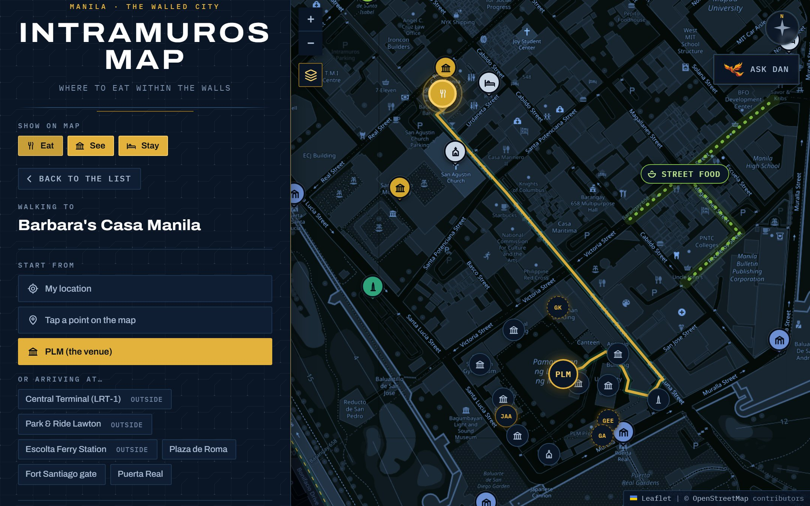
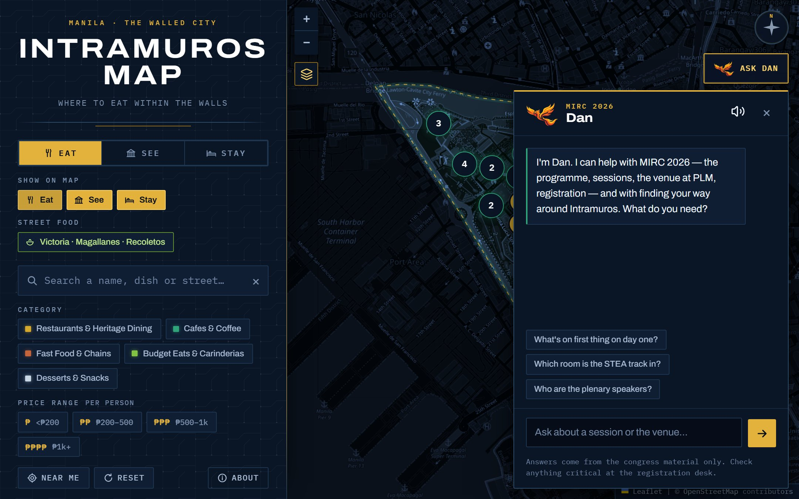
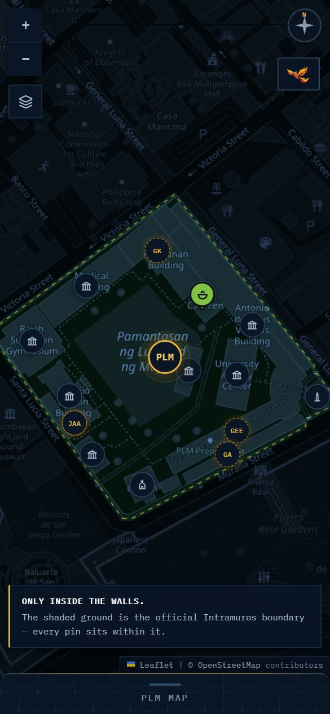

# Intramuros Guide

[](https://github.com/MarkDaniel0702/MIRC-2026-Interactive-Intramuros-Food-Map-Guide/actions/workflows/deploy.yml)
[](LICENSE)

An interactive map of the walled city of Manila, built for researchers visiting
**MIRC 2026** at Pamantasan ng Lungsod ng Maynila (PLM). It shows where to eat, what to
see and where to stay, gives step-by-step walking directions to any of it, and includes
**Dan**, an AI assistant that knows the congress programme.

### 🗺️ [mirc2026interactivemap.me](https://mirc2026interactivemap.me/)



---

## Features

### Two map views

- **PLM Map** (the default). The MIRC 2026 venue and its campus: a **venue strip**
  (PLM campus, JAA, GK, GEE, GA) that jumps to each session building, plus a list of every
  other place on campus.
- **Intramuros Map**. Tap the layers button under the zoom controls to open the whole
  walled city, browsed through three tabs:

| Tab | Contents |
|---|---|
| **Eat** | **67** restaurants, cafés, carinderias, fast-food branches and hotel dining rooms, each with a price range (58 OSM-verified, 9 user-pinned; see [`DATA.md`](DATA.md)) |
| **See** | **21** heritage sights, with entrance fees, opening hours and realistic visit times |
| **Stay** | **2** hotels: the properties inside the walls that have both a public booking path and a published price (see [`HOTELS.md`](HOTELS.md)) |



### Finding things

- **Search** by name, dish, cuisine, street or period. Press <kbd>/</kbd> to jump to the search box.
- **Filter** by category and by price or entrance fee, in any combination.
- **Show on map** puts Eat, See and Stay pins on the map together, whichever tab's list is open.
- **Street food**: the unnamed stalls along Victoria, Magallanes and Recoletos Streets are
  drawn as one zone, not a pin per stall, and have their own chip on the Eat tab.
- **The list and the map stay in sync.** Hovering a card lifts its pin, clicking a card
  flies the map to it, and clicking a pin scrolls its card into view.
- **Near me** sorts everything by walking distance from your location.

### Walking directions



Click any marker or list entry, then **Get directions**. You can start from your current
location, from a point you tap on the map, from **the venue** (for the walk from PLM to
lunch), or from one of six arrival presets. Three of those presets (LRT Central Terminal,
Park & Ride Lawton and Escolta Ferry) are outside the walls and labelled that way; they are
offered only as starting points, never as destinations. The PLM campus and each of its
buildings have the same button, so a delegate can be walked to the building their session
is in, not just to the campus gate.

- Routes come from the **FOSSGIS OSRM pedestrian service**, the same one
  openstreetmap.org uses. It needs no API key. OSRM returns maneuver objects rather than
  sentences, so [`src/lib/routing.ts`](src/lib/routing.ts) writes the step-by-step
  instructions itself.
- OSRM cannot route inside the gated PLM campus. Routes into or out of it are joined to a
  fixed walk through the General Luna Street gate, then follow the campus's own mapped
  footpaths ([`data/plm-paths.js`](data/plm-paths.js)) to the building.
- **Track my location live** follows you along a drawn route with the distance left, an
  ETA, and whether you're getting closer or farther. A low-accuracy fix or a denied
  permission is reported in plain words.
- **If routing is unavailable**, you still get a straight-line distance, a walking
  estimate and a link to OpenStreetMap directions.

### Meet Dan



**Ask Dan** (top right) opens a chat panel. Dan answers questions about the MIRC 2026
programme (sessions, speakers, rooms, registration) and about Intramuros (getting around,
its history, walls and heritage). Everything else gets a polite decline.

- **Grounded only in the congress material**, not general knowledge. If something hasn't
  been published, Dan says so instead of guessing.
- **Answers in the asker's language**: English (Philippine, Australian, British or
  American), Filipino, Malay, Mandarin Chinese, French or Portuguese.
- **Reads answers aloud** with the browser's built-in speech synthesis. The speaker button
  in the panel header mutes it.
- **Can point at the map.** Ask "where is GEE?" and the reply comes with a **Show on the
  map** button, one tap from directions.

How it works: the corpus ([`public/data/chat-corpus.json`](public/data/chat-corpus.json))
is cut down to a slice shaped to the question before any model sees it. That is what lets
a free-tier model handle congress-scale traffic. Common questions are answered from a
reviewed set of **warm answers** or from Cloudflare's edge cache, with no model call at
all. The site itself holds no API key. A small Cloudflare Worker ([`worker/`](worker/))
is the only server-side piece; it tries **Groq** first and falls back to **Gemini**, then
**OpenAI** (Anthropic is also supported). The full pipeline, retrieval design and setup
are in **[`CHATBOT.md`](CHATBOT.md)**.

### On a phone

On a phone, the panel becomes a **drag-up sheet** anchored to the bottom of the map. It
starts collapsed to a handle, so the map is the first thing you see. Every feature works
the same way, reflowed for a narrow screen.



It's also keyboard accessible, labelled for screen readers, and honours
`prefers-reduced-motion`.

---

## Everything on the map is inside Intramuros, and that's enforced

The guide's one hard rule: nothing from Binondo, Ermita, Malate or Quiapo appears. A
script enforces it. Every place was collected by querying **inside the official boundary
polygon** (OpenStreetMap relation [`103707`](https://www.openstreetmap.org/relation/103707)),
and the script re-checks every coordinate against that same polygon:

```bash
node tools/verify-in-intramuros.mjs
```

```
  1. Location — is every spot inside Intramuros?
     All 67 spots are inside the official Intramuros boundary.
  2. Schema — is every record well formed?
     All 67 records are well formed.
     9 of them are user-pinned (no OSM node; exact coordinate supplied by a person).
  3. Tourist spots — is every sight inside Intramuros?
     All 21 sights are inside the official Intramuros boundary.
  4. Accommodation — is every property inside Intramuros?
     All 8 properties are inside the boundary (3 open to travellers, 2 shown on the map).
  5. Landmarks — is every highlighted landmark inside Intramuros?
     All 14 landmark(s) are inside the official Intramuros boundary.
  6. Street food area — does every point of its lines sit inside Intramuros?
     PASS  Street food stalls                     12 points on 3 streets

  VERIFIED — every spot is inside Intramuros and every record is valid.
```

(Per-record lines and the category breakdown are omitted here.) It exits non-zero on any failure, so it works as a pre-commit or CI
gate. Run it after touching any file in `data/`. The same polygon is drawn on the map as
the lit ground, with everything outside it dimmed.

The nine eateries with no OpenStreetMap node are **user-pinned**: an exact coordinate a
visitor supplied (a Google Maps pin), boundary-checked like everything else. One such pin
landed about 2 km outside the walls and was rejected. The tooling also supports a second
class, **address-estimated** (placed from a street address and shown with a dashed
marker), but no records use it at the moment.

---

## Tech stack

| Layer | What |
|---|---|
| UI | [React](https://react.dev/) 18 + TypeScript |
| Build | [Vite](https://vite.dev/) 6 (`@vitejs/plugin-react`) |
| Map | [Leaflet](https://leafletjs.com/) 1.9 + [Leaflet.markercluster](https://github.com/Leaflet/Leaflet.markercluster), OpenStreetMap tiles |
| Routing | [FOSSGIS OSRM](https://routing.openstreetmap.de/) foot profile, called straight from the browser |
| Assistant | Cloudflare Worker (plain JavaScript, no dependencies) → Groq / Gemini / OpenAI / Anthropic |
| Speech | Web Speech API (`speechSynthesis`), in the browser |
| Fonts | Archivo + IBM Plex Mono (Google Fonts) |
| Hosting | GitHub Pages via GitHub Actions; custom domain `mirc2026interactivemap.me` |
| Data tooling | Node scripts in `tools/`; two Python importers (need `openpyxl`) for the congress documents |

There are only four runtime dependencies (`react`, `react-dom`, `leaflet`,
`leaflet.markercluster`). Icons are inline SVG.

---

## Getting started

**Prerequisites:** Node.js 22 (what CI uses) and npm. Nothing else is needed to run
the map. You don't need an account or an API key.

```bash
git clone https://github.com/MarkDaniel0702/MIRC-2026-Interactive-Intramuros-Food-Map-Guide.git
cd MIRC-2026-Interactive-Intramuros-Food-Map-Guide
npm ci
npm run dev          # http://localhost:5173/
```

| Command | What it does |
|---|---|
| `npm run dev` | Vite dev server with hot reload |
| `npm run build` | Type-checks (`tsc -b`), then builds the site into `dist/` |
| `npm run preview` | Serves the built `dist/` locally, to check a build before pushing |
| `npm run typecheck` | Type-checks only |

In development, the dev server proxies `/chat` to the deployed Worker (`vite.config.ts`),
so Dan works locally without adding `localhost` to the Worker's CORS allowlist. `npm run
preview` calls the Worker directly, so Dan won't answer there.

### Checks

The project has no unit-test framework. Instead, a set of standalone Node scripts act as
its tests. The ones below run **offline**: no API key, no quota, no network.

| Command | Checks |
|---|---|
| `node tools/verify-in-intramuros.mjs` | Every record is inside the boundary and well formed (the data gate) |
| `node tools/check-campus-walk.mjs` | Campus routing reaches every PLM building along the mapped paths |
| `node tools/eval-retrieval.mjs` | Dan's retrieval puts the right record in the slice (73 cases) |
| `node tools/eval-focus.mjs` | "Show on the map" points at the right place, and stays silent when there isn't one |
| `node tools/eval-cache.mjs` | Warm answers match when they should and refuse near-misses |
| `node tools/eval-fallback.mjs` | The Worker's provider chain falls back correctly (stubbed `fetch`) |

Two scripts need a model key and call a real provider: `tools/try-dan.mjs` (an end-to-end
acceptance run) and `tools/warm-cache.mjs` (regenerates `data/warm-answers.json`). See
`CHATBOT.md` for how to run them.

---

## Configuration

**The static site has no environment variables and no secrets.** The few values worth
knowing about are constants in the code:

| Where | What |
|---|---|
| `VENUE_ANCHOR` in [`data/tourist-spots.js`](data/tourist-spots.js) | The point every "N min walk" is measured from (PLM's OSM centre). Move it and every distance re-bases itself. |
| `WORKER_URL` in [`src/components/ChatPanel.tsx`](src/components/ChatPanel.tsx) | The deployed Worker the chat panel posts to in production |
| `L.tileLayer(...)` in [`src/hooks/useLeafletMap.ts`](src/hooks/useLeafletMap.ts) | The map tile provider. The navy tint in `src/styles.css` sits on top of whatever tiles load. |
| `base` in [`vite.config.ts`](vite.config.ts) | `/`, because the site is served from the root of its custom domain |

**The Worker** is configured in [`worker/wrangler.toml`](worker/wrangler.toml):

| Name | Kind | Purpose |
|---|---|---|
| `CORPUS_URL` | var | Where the Worker reads the built corpus (the raw GitHub copy of `public/data/chat-corpus.json`) |
| `ALLOWED_ORIGINS` | var | CORS allowlist. If it's empty, every browser origin is refused (fails closed). |
| `PROVIDER_ORDER` | var | Provider fallback order; default `groq,gemini,openai,anthropic` |
| `GROQ_MODEL`, `GEMINI_MODEL`, `OPENAI_MODEL`, `ANTHROPIC_MODEL` | var | Pinned model ids |
| `GROQ_API_KEY`, `GEMINI_API_KEY`, `OPENAI_API_KEY`, `ANTHROPIC_API_KEY` | **secret** | Set with `npx wrangler secret put <NAME>` in `worker/`. Configure at least one. |

API keys live only in Cloudflare's secret store. **Never put a key in `wrangler.toml`, the
client code, or any committed file.** `.env*`, `.dev.vars*` and `*.key` are gitignored for
that reason.

---

## Deployment

- **Site:** push to `main`. [`.github/workflows/deploy.yml`](.github/workflows/deploy.yml)
  runs `npm ci && npm run build` and publishes `dist/` to GitHub Pages. You never build
  by hand. One-time setup, the post-deploy checklist, the custom-domain wiring and
  troubleshooting are all in **[`DEPLOY.md`](DEPLOY.md)**.
- **Dan's Worker:** deployed separately, with `cd worker && npx wrangler deploy`, plus at
  least one API key set as a secret. See **[`CHATBOT.md`](CHATBOT.md)**. Until a key is
  set, the chat panel still opens and says plainly that it can't answer yet. Nothing else
  on the site depends on the Worker.
- **Content updates for Dan:** edit `data/mirc-2026.json`, run
  `node tools/build-corpus.mjs`, and push. The Worker picks up the new corpus within five
  minutes; no redeploy is needed.

---

## Project structure

```
index.html                     Vite entry: meta tags, icons, manifest, Open Graph
vite.config.ts                 base path + the dev-only /chat proxy
src/
  main.tsx                     mounts React; imports Leaflet CSS and styles.css
  App.tsx                      layout: Panel + MapView + ChatPanel + AboutDialog
  styles.css                   design tokens, responsive layout, map and popup styling
  state/store.ts               app state (useReducer): mode, filters, selection, directions
  hooks/useLeafletMap.ts       the imperative map core: markers, popups, flyTo, live tracking
  hooks/                       useVisibleSpots, useMapVisibleIds, useToasts
  components/                  Panel, SpotList, DirectionsPanel, VenueBar, ChatPanel, …
  lib/                         routing.ts (OSRM + campus walk), popupHtml, format, icons, filter
  data/modes.ts                the Eat/See/Stay config and one-time search index
  data/destinations.ts         resolves a "Get directions" target (spot or landmark)
data/
  food-spots.js                67 food spots · 58 OSM-verified + 9 user-pinned
  tourist-spots.js             21 sights · fee tiers, VENUE_ANCHOR, Intramuros Passport
  hotels.js                    8 properties · 2 flagged `mapped` for the Stay tab
  landmarks.js                 PLM + 13 campus buildings (shown when zoomed in)
  street-food.js               the street food zone, drawn along its streets
  start-points.js              the venue + 6 arrival points for directions
  intramuros-boundary.js       the official boundary polygon (OSM relation 103707)
  plm-boundary.js, plm-paths.js   the campus outline and its walkable paths
  mirc-2026.json               the congress knowledge base Dan answers from
  warm-answers.json            reviewed answers to common questions
  types.d.ts                   TypeScript shapes for the files above
public/                        copied as-is into dist/
  data/chat-corpus.json        built corpus (tools/build-corpus.mjs), read by the Worker
  404.html                     branded not-found page; forwards old /MIRC-2026-… links
  favicon.svg, icon-*.png, apple-touch-icon.png, og-image.jpg, site.webmanifest
  robots.txt, sitemap.xml, .nojekyll
worker/                        the Cloudflare Worker behind Dan
  src/index.js                 request handling, prompt, guards, provider chain
  src/retrieve.js, focus.js, cache.js   retrieval, map focus, warm answers + edge cache
tools/                         data gate, evals, corpus builder, importers (see Checks)
  load-test/                   k6 load-test script and its reports against the live site
docs/                          README screenshots
DATA.md · HOTELS.md · CHATBOT.md · DEPLOY.md   sources and method, hotel research, Dan, deployment
```

To add a place, edit one array in `data/` and re-run the verify script. The map and the
list both read from the same data, so nothing else needs to be kept in step.

Comments of the form `app.js:NNN` or `index.html:NNN` point at the pre-React, plain-JS
version of the app. It lives in git history before commit `83ed6fb` ("Migrate app to
Vite + React").

---

## About the data

Names and coordinates come from **OpenStreetMap** via the Overpass API. They were
retrieved on 2026-09-04 and cross-checked against Nominatim, and there have been later
additions and corrections, all logged in `DATA.md`.

- **Entrance fees** come from the Intramuros Administration and the site operators. They're
  published and reasonably stable. The See tab also points out the ₱350 **Intramuros
  Passport**, which covers five sites.
- **Restaurant prices are indicative estimates, not quotes.** Few places publish menu
  prices, so each spot gets a tier plus an explicit peso band and a review date.
- **Hotel rates are a dated snapshot**, not live pricing.
- **Dan answers only from the congress's own material** (`data/mirc-2026.json`). Details
  the committee hasn't supplied yet are listed in `CHATBOT.md`. Dan doesn't guess at them.

The reasoning behind all of this, including what *couldn't* be verified, is in
[`DATA.md`](DATA.md) and [`HOTELS.md`](HOTELS.md).

---

## Privacy

There are no accounts, no sign-up and no forms. **No cookies, no analytics, no ad
tracking.**

- **Your location**, if you share it, stays in the browser. It's sent (as coordinates) only
  to the OSRM routing service, and only when you ask for directions.
- **Questions you ask Dan** go through the Cloudflare Worker to an AI provider (Groq, with
  Gemini and OpenAI as fallbacks) to generate an answer. They may be logged server-side so
  the committee can fill gaps in the material. They're never tied to a name or an account.

The statement shown to users is in the app's **About** dialog
(`src/components/AboutDialog.tsx`).

---

## Known limitations

- **Prices and hotel rates are estimates, not live quotes.** Confirm anything
  time-sensitive with the venue.
- **Dan only knows what's in `data/mirc-2026.json`.** A few programme details are still
  missing from the source material. They're tracked in `CHATBOT.md`.
- **Dan runs on free tiers with daily ceilings.** Retrieval, warm answers and the edge
  cache keep normal use well inside them, and paid providers sit behind as a fallback. On
  a very busy day Dan can still get rate-limited, and the panel says so.
- **The Worker's rate limit is best-effort.** It's counted per Worker isolate, so it
  smooths bursts but isn't a hard global cap (see `worker/src/index.js`).
- **Live tracking and Near me need a GPS fix and a secure context** (`https://`). They
  won't work over plain `http://` or from `file://`.
- **OSRM can't route inside the PLM campus.** The campus leg is stitched on through the
  General Luna Street gate (see Directions above, and `DATA.md` §8).
- **Dan's voice depends on the device.** Speech uses whatever voices the OS provides, so
  it sounds different on Windows, Android and iOS.

---

## License

The source code is released under the **[MIT License](LICENSE)**. © 2026 Mark Daniel Apelledo.

The MIT License covers the code in this repository. It does not cover third-party data or
services:

- Map data, place information and the boundary polygon are © [OpenStreetMap](https://www.openstreetmap.org/copyright)
  contributors, available under the [ODbL](https://opendatacommons.org/licenses/odbl/).
  Records in `data/` that are derived from OpenStreetMap remain under the ODbL.
- Walking routes are provided by the [FOSSGIS OSRM service](https://routing.openstreetmap.de/).
- Libraries, fonts and icons keep their own licenses: Leaflet (BSD-2-Clause),
  Leaflet.markercluster and React (MIT), Archivo and IBM Plex Mono (SIL OFL), and the
  inline layers and volume icons from [Lucide](https://lucide.dev/) (ISC).

Categories, price tiers, visit durations and descriptions were written for this project.

## Credits

Created by **Mark Daniel Apelledo**, creator of the Intramuros Map and of Dan, its AI guide.

Built under the guidance of advisers **Dr. Dan Michael A. Cortez**, **Ms. Editha S. Medina**
and **Mr. Neil Marcus T. Manubay**.

**Christian Andrei V. Santiago** added Dan's voice and is credited specifically for
building the text-to-speech capability. **Alvin V. Genota** is a consultant to the
creators: he was Mr. Santiago's professor last year and is currently Mr. Apelledo's
Intelligent Systems professor.
